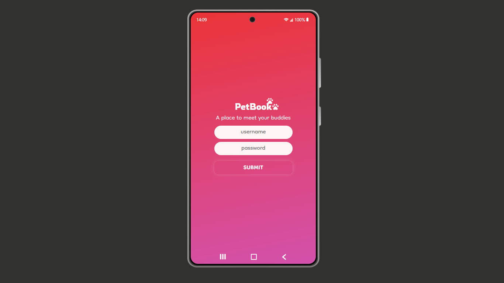

## In this project I build a simple social network for pets based on codecademy project that you can find on React's course 
#### Also, I put a Clock that works according your local time, a login system to control acesss and a button to change the background color
#### if you wish to try this code on your pc, make sure you have react app and node installed before ;)
#### create a local server and replace this code into your new file

 You can watch a video presentation on my linkedin too: 

 
  

 
  

